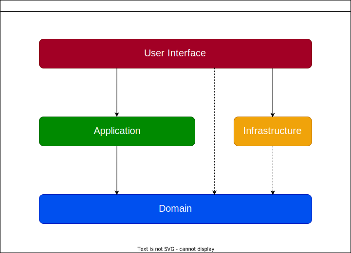
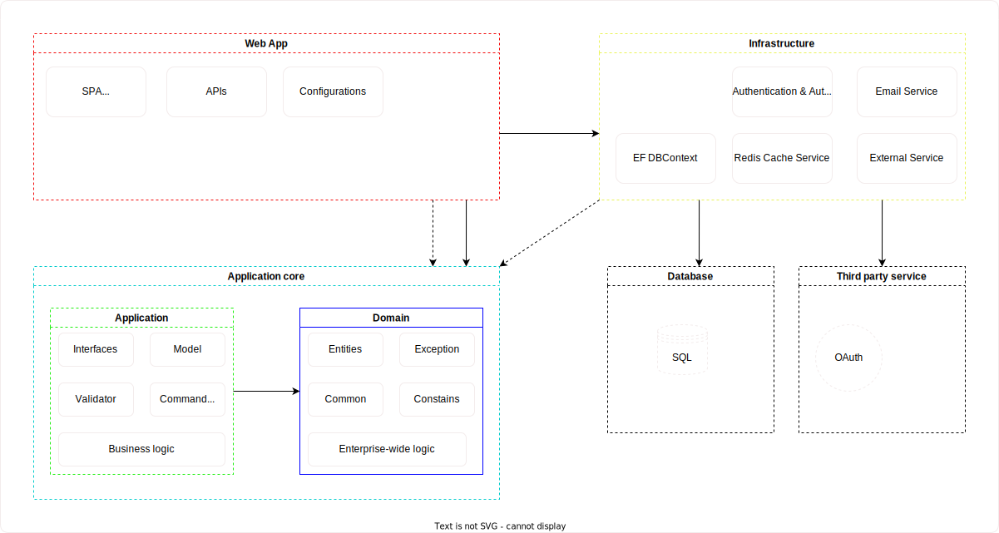

# ExpenditureManagement

## Current status

## Project architecture

### Clean architecture

- Domain contains enterprise-wide logic and types
- Application contain business-logic and types
- Infrastructure contains all external concerns
- UI and infrastructure depend only on Application
- UI and Infrastructure components can be replaces with minimum efforts.

### Detail structure

- Application

## Database
